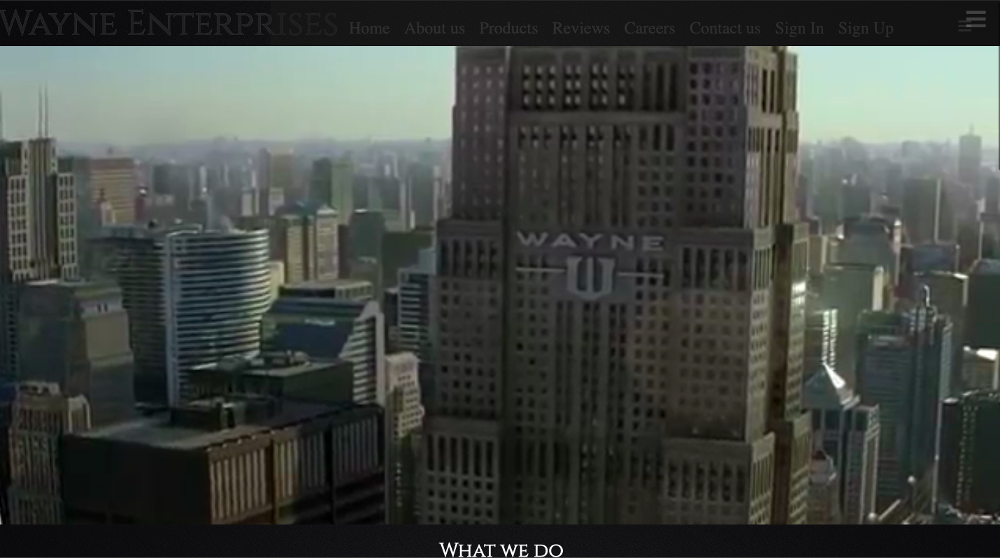

#  
# WayneEnterprises

### User Stories

This is a web application that aims to make use of basic HTML, CSS, 
and JavaScript to promote a fictional company

### Minimum Viable Product

* Users will be able to view all kinds of information about the company
* Usage of basic JavaScript
* Include forms such that a user can enter their information

### Approach Taken

* Used HTML & CSS as a canvas for presenting information
* Incorporated animations through the use of JavaScript
* Implemented a mock form in order to emulate a submission

### Technologies used

* **HTML** To display elements onto the page
* **CSS** To style components of the page 
* **JavaScript** To animate certain elements

### Installation Instructions
* Open HTML files in the browser
